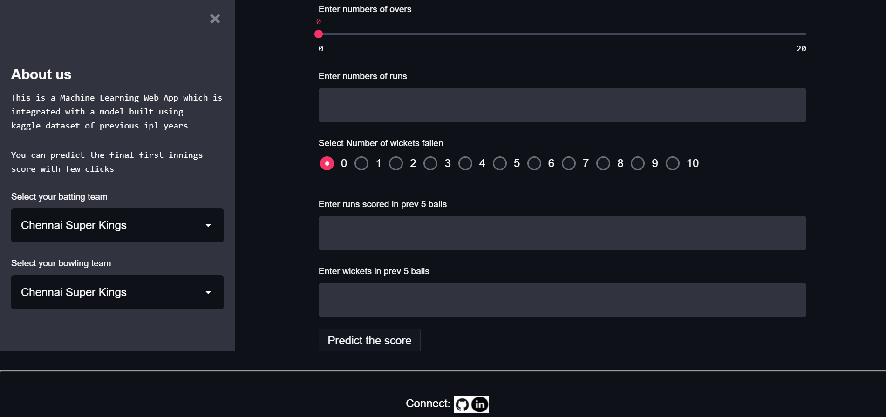

# IplScorePredictor
This is a Machine Learning Web App which is 
integrated with a model built using 
kaggle dataset of previous ipl years

<h2>Methodology</h2>
Enter the current batting and bowling team.  
Also input current stats like total wickets fallen,overs,current score,runs scored in previous 5 balls,wickets fallen in previous 5 balls. 
Click the predict score button and final first innings score will be predicted. 

<h2>Flowchart</h2>
 

 
 

<h2>Live Link for the Web App</h2>
https://ipl21scorepredictor.herokuapp.com/
